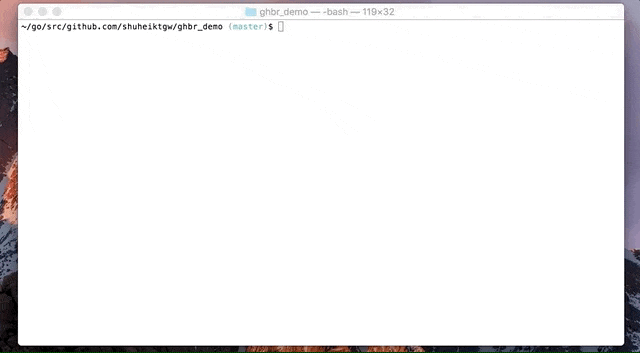
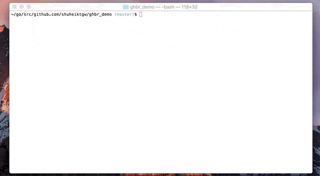

ghbr
====
[](release)
[](https://travis-ci.org/shuheiktgw/ghbr)
[](LICENSE)

`ghbr` is a CLI tool to create and release your Homebrew Formula with one command.

## Demo

### `ghbr create`



### `ghbr releasse`



## Usage
In order to use `ghbr`, you need a GitHub personal access token (See [GitHub personal access token section](#github-personal-access-token) for more information).

`ghbr` has three sub commands, `create`, `release` and `version`.

### `ghbr create` 

`ghbr create` creates a GitHub repository to host your Homebrew formula.

```bash
$ cd [Root of Your Application]
$ ghbr create [Options]
```

#### Options

```
Aliases:
  create, init

Flags:
  -f, --font        caveats Ascii Font from go-figure (default "isometric3")
  -h, --help        help for create
  -o, --owner       GitHub repository owner name (default value set .git/config)
  -p, --private     If true, GHBR creates a private repository on GitHub (default false)
  -r, --repository  GitHub repository (default value set .git/config)
  -t, --token       GitHub personal access token (default value set via env or .gitconfig)
```

#### Inside `create` Sub Command
`ghbr create` does the following stuff for you.

1. Fetch the latest `Darwin AMD64 (for Mac)` release of your application's repository
2. Create a new repository named `homebrew-[Your Application Name]` on Your GitHub.
3. Create a brief `README.md` on the repository
4. Create `[Your Application Name].rb` file on the repository, which includes all the necessary information to `brew install` 

After successfully running the command, your application can be installed via `brew tap [GitHub Owner Name]/[Your Application Name]` and `brew insatll [Your Application Name]`. 

For more information, see [How to install Homebrew formula created by ghbr](#how-to-install-homebrew-formula-created-by-ghbr).

### `ghbr release`

`ghbr release` updates a formula file based on the latest release of your application.

```bash
$ cd [Root of Your Application]
$ ghbr release [Options]
``` 

#### Options

```
Aliases:
  release, update, bumpup

Flags:
  -b, --branch      GitHub branch (default "master")
  -f, --force       Forcefully update a formula file, even if it's up-to-date (default false)
  -h, --help        help for release
  -m, --merge       Merge a Pull Request or not (default false)
  -o, --owner       GitHub repository owner name (default value set .git/config)
  -r, --repository  GitHub repository (default value set .git/config)
  -t, --token       GitHub personal access token (default value set via env or .gitconfig)
```

#### Inside `release` Sub Command

`ghbr release` does the following stuff behind the scenes.

1. Fetch the latest `Darwin AMD64 (for Mac)` release of your application's repository
2. Extract the latest release version and its url, and calculate its checksum
3. Create a pull request to update `version`, `url` and `sha256` in a formula file
4. Merge the pull request (optional)

Please be aware that, if you do not specify `--merge` option, you need to manually merge the pull request created by ghbr.

### `ghbr version` 

Returns the current version of `ghbr`, it gives you a warning if your current version is not up-to-date.

```bash
$ ghbr version
```

## GitHub personal access token

### How to get a GitHub personal access token
`ghbr` needs a GitHub personal access token with enough permission to create and update your repository. If you are not familiar with the access token, [This GitHub Help page](https://help.github.com/articles/creating-a-personal-access-token-for-the-command-line/) guides you though how to create one.

Please be aware that, for a public repository, you just need `public_repo` scope, and for a private repository, you need whole `repo` scope.

### How to set a GitHub personal access token
Currently, there are three ways to specify your GitHub personal access token.

1. `-t` or `-token` option

```bash
$ ghbr [Sub Command] -t="Your GitHub personal access token" [Other Options]
```

2. Environment variable
```bash
$ export GITHUB_TOKEN="Your GitHub personal access token"
```

3. `github.token` in `.gitconfig`

[This GitHub Post](https://blog.github.com/2008-10-11-local-github-config/) helps you set `github.token`.  

```
$ git config --global github.token "Your GitHub personal access token"
```

`ghbr` looks for a token first from `-t` option, next env and last `.gitconfig`. For example, if you set a token via `-t` option, your `GITHUB_TOKEN` env will be ignored.

## Install

If you are MacOS user, you can use [Homebrew](http://brew.sh/):

```bash
$ brew tap shuheiktgw/ghbr
$ brew install ghbr
```

If you use another OS, you can download a suitable binary from [release page](https://github.com/shuheiktgw/ghbr/releases) and place it in `$PATH` directory.

Alternatively, if you are Golang programmer, you can use `go get`.

## How to install Homebrew formula created by ghbr

All you need to do to install your Homebrew formula is run the following command.

```bash
$ brew tap [GitHub Owner Name]/[Your Application Name]
$ brew install [Your Application Name]
```

## ghbr and CI Example

`ghbr` itself uses `ghbr` to update a formula file hosted in [shuheiktgw/homebrew-ghbr](https://github.com/shuheiktgw/homebrew-ghbr) with [Travis CI](https://travis-ci.org/). If you want to grasp an idea on how to use `ghbr` with CI, check out [.travis.yml](https://github.com/shuheiktgw/ghbr/blob/master/.travis.yml) and [deploy.sh](https://github.com/shuheiktgw/ghbr/blob/master/deploy.sh).

Also, if you are Golang programmer and automation freak like me, `ghbr` works very well with [goxz](https://github.com/Songmu/goxz) and [ghr](https://github.com/tcnksm/ghr) to automate your build. So please check the two files above to know how to use `ghbr` with them. 

## Author

[Shuhei Kitagawa](https://github.com/shuheiktgw)